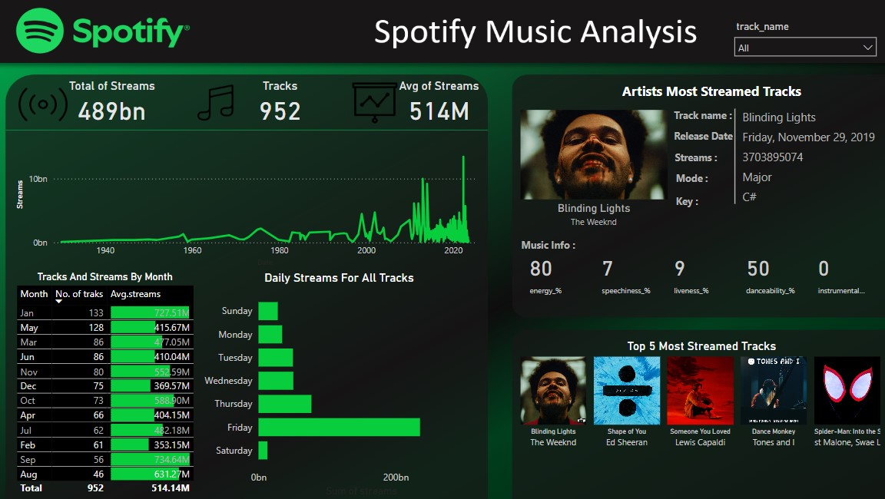

# Spotify Music Streaming Analytics

**Interactive dashboard analyzing 489B streams across 952 tracks & 514M artist plays, featuring monthly/daily trends, top streamed tracks, and most-binding lights visualization.**

## 🎵 Key Metrics
| KPI | Value |
|-----|-------|
| **Total Streams** | **489B** |
| **Total Tracks** | **952** |
| **Artist Plays** | **514M** |

## 📈 Highlights
- **Peak Months**: High streaming seasons identified
- **Daily Patterns**: Weekend streaming surge
- **Top Tracks**: Artist/track dominance analysis

## 🛠️ Tech Stack
- **Power BI** | Time-series analysis | Top N ranking

## 🚀 Quick Start
1. Download `Spotify-Streaming-Analysis.pbix`
2. Open in **Power BI Desktop**
3. Uncover music streaming trends!

## 📞 Contact
Have questions about the dashboard or want to collaborate?  
**Email**: Abdelrahman.Gamal.Ai@gmail.com | **LinkedIn**: [linkedin.com/in/yourprofile](https://www.linkedin.com/in/abdelrahman-gamal236/) | **whatsapp**: +201029744194

---
⭐ Star if helpful! 👨‍💻 Built by **[Abdelrahman Gamal]**
